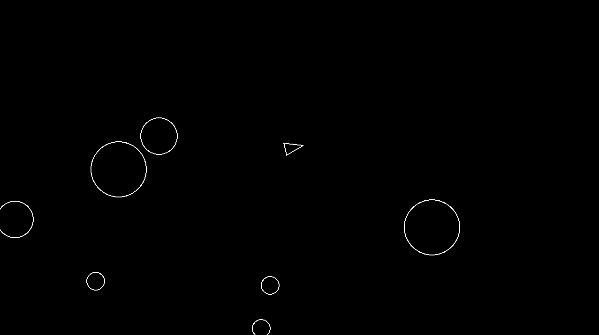

# 🚀 Asteroids Game (Pygame)

Um jogo simples inspirado no clássico **Asteroids**, desenvolvido em **Python** usando **Pygame** como parte dos estudos de programação e game development.



---

## 🎮 Controles

- **W** → Mover para frente  
- **S** → Mover para trás  
- **A** → Girar para a esquerda  
- **D** → Girar para a direita  
- **Espaço** → Atirar  

---

## 🧠 Mecânicas

- Asteroides se dividem em dois menores ao serem atingidos
- Sistema de **cooldown de tiro** (0.3s)
- Colisão com asteroides encerra o jogo
- Movimento baseado em vetores

---

## 🛠️ Tecnologias usadas

- Python 3
- Pygame

---

## ▶️ Como executar

1. Clone o repositório:
```bash
git clone git@github.com:vinitiws/asteroid.git
